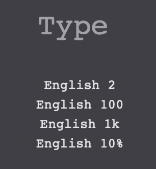
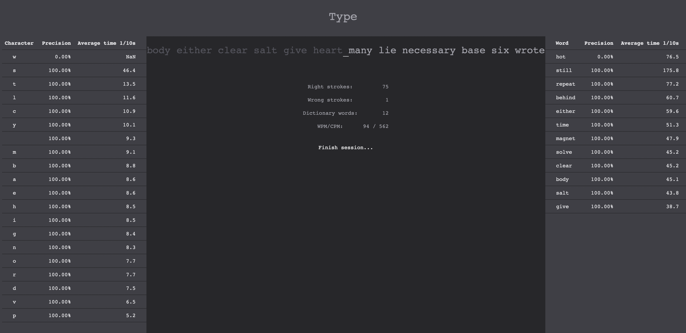

# Simple typing trainer

This is some small project that allows to train typing with tracking best/worse words per minute (WPM) and characters per minute (CPM).

## Implementation & Collaboration
It is written with TypeScript + ReactJS and adheres to Domain-Driven-Design (DDD). Session results are for now only stored in the browser local storage.

It should be very easy to extend either by storage, by dictionaries, or other functionality. Feel free to contribute!

## Current todos

* Stats are stored on rough level but not reported nicely
* Just taking the average of all typings makes little sense, probably some rolling horizon method would be more interesting

## Screenshots

